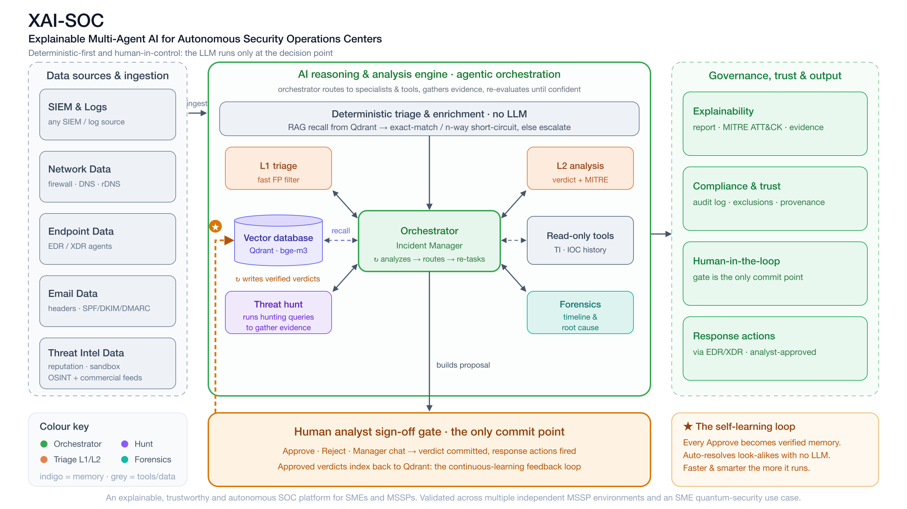

# EKSIR

**An analyst-grade SOC workbench: deterministic triage and enrichment, an agent-persona LLM investigation, and a human sign-off gate that is the only thing allowed to commit a verdict or fire a response action.**

[](https://github.com/tallcyberguy/eksir/actions/workflows/ci.yml)
[](https://github.com/tallcyberguy/eksir/actions/workflows/security.yml)
[](./LICENSE)
[](https://www.python.org/)
[](https://nextjs.org/)

EKSIR automates the deterministic parts of alert triage (parsing, threat-intel
enrichment, similar-case recall, auto-close) and then runs a chain of LLM
analyst personas (L1 classify → L2 deep analysis → optional hunt / forensics →
manager) that **parks at a human sign-off gate**. The AI proposes; the analyst's
**Approve** is the only action that writes a verdict or triggers live
containment. It is self-hostable on a single box, multi-tenant for MSSP use, and
the LLM backend is swappable (a hosted API such as Claude, or a fully local
model via Ollama / vLLM).

> **Repo codename:** `isoc` · **Product name:** EKSIR. Packages, routes, and the
> docker-compose project use `isoc_*` names; the UI and docs say EKSIR.

---

## Table of contents

- [Why EKSIR](#why-eksir)
- [Architecture](#architecture)
- [Feature highlights](#feature-highlights)
- [Quick start](#quick-start)
- [Configuration](#configuration)
- [Upgrading](#upgrading)
- [Documentation](#documentation)
- [Design principle: the analyst gate](#design-principle-the-analyst-gate)
- [A note on dynamic malware analysis](#a-note-on-dynamic-malware-analysis)
- [Contributing](#contributing)
- [Security](#security)
- [License](#license)

---

## Why EKSIR

Most "AI SOC" tools either bury the analyst in raw alerts or quietly
auto-resolve them. EKSIR takes a deliberate middle path:

- **Deterministic first, LLM second.** Enrichment is plain code (threat intel,
  WHOIS/rDNS, vector similarity, local IOC feeds, exclusions). A confident gate
  (exact match / n-way agreement / auto-close rule) short-circuits with **no LLM
  call at all**. The LLM runs only when human-grade judgement is actually needed.
- **The AI proposes, the analyst commits.** Personas and the conversational
  manager only ever build a *proposal*. No verdict is written and no EDR action
  is fired until an analyst approves it at the gate. This is enforced in code,
  not by convention.
- **Local-first and swappable.** Run it on one machine. Point it at Claude, any
  OpenAI-compatible endpoint, or a local model. Embeddings (bge-m3) are
  decoupled from the chat model.
- **Built for MSSPs.** Multi-tenant throughout, with per-tenant credential
  isolation, RBAC, an MSSP rollup dashboard, and branded per-customer reports.

---

## Architecture



One host, one `docker compose`:

```
Browser ──▶ Caddy ──▶ Next.js 15 (UI) ──▶ FastAPI orchestrator (:8000) ──▶ ARQ worker
                                                     │                          │
                              Postgres · Redis · Qdrant · LiteLLM (:4000)   REMnux (docker exec, forensics profile)
```

- **Frontend** — Next.js 15 (App Router), Tailwind, three themes.
- **Backend** — FastAPI orchestrator + an ARQ worker that runs the pipeline.
- **Data** — Postgres (state), Redis (queue/cache), Qdrant (vectors:
  `alerts_v2`, `iocs_v2`, `knowledge_base_v2`).
- **LLM** — routed through the LiteLLM proxy; provider-agnostic via the OpenAI
  SDK. Ships routing the deep tier to Claude Sonnet and the fast tier to Claude
  Haiku; swap to a local model in one config file.
- **Forensics (optional profile)** — a network-isolated REMnux container with
  YARA-Forge rules baked in, driven over `docker exec` from the worker only.

See [`docs/PIPELINE.md`](docs/PIPELINE.md) for the full state machine and
[`docs/DESIGN.md`](docs/DESIGN.md) for the design rationale.

---

## Feature highlights

| Area | What it does |
|---|---|
| **Ingest** | OCSF-normalized connectors (Microsoft Defender, Trend Micro Vision One) plus HMAC-signed webhooks and paste-text; per-tenant routing; scheduled pull ingestion and batch/historical import |
| **Pipeline** | Deterministic parse → auto-close → dedup → enrich → OCSF entity resolution → correlation → decision gate, with a confident short-circuit that uses no LLM |
| **Agent-persona synthesis** | L1 classify → L2 deep analysis (markdown report + a structured verdict) → optional threat hunt → optional forensic reasoning → deterministic manager, parked at the gate |
| **Human sign-off gate** | Approve commits the verdict (indexed to the vector DB) and runs only the analyst-checked response actions; Reject requeues or drops; a conversational manager can revise the proposal before sign-off |
| **Enrichment** | MalwareBazaar / ThreatFox / URLhaus / VirusTotal / AbuseIPDB / OTX, WHOIS, rDNS, vector similar-case recall (bge-m3), KB hits, graded local threat-intel scoring |
| **Confidence + threat scoring** | Two fused 0–100 scores per incident (verdict confidence, and effective threat = inherent × P(malicious)) surfaced on the list and detail views |
| **Response actions** | Provider-aware, analyst-gated: **Microsoft Defender** (isolate / AV scan / add indicator / disable user) and **Trend Micro Vision One** (isolate / restore / blocklist / collect file), plus verdict write-back to the source alert |
| **Threat IOCs** | Daily public OSINT feed sync (Emerging Threats, Tor exits, abuse.ch URLhaus / MalwareBazaar / ThreatFox / SSLBL), exclusions DB with an admin UI |
| **Customer cases** | Promote an incident to a case, generate a locale-aware customer summary (EN/TR), attach related incidents, preview and SMTP-send, surface "actions we took" |
| **Branded reports** | Scheduled or on-demand per-tenant SOC reports rendered to HTML + PDF (WeasyPrint); the cron only drafts, the analyst-gated Send is the only outbound step |
| **Forensics** | File-type-aware **static** analysis (PE / Office / PDF / ELF / Mach-O / script / archive) with YARA-Forge + capa MITRE mapping and an LLM-synthesized verdict |
| **Threat hunting** | Plain-English → S1QL / KQL / Sigma translation, live Defender advanced-hunting (gated), saved hunts |
| **Attack surface (EASM)** | External asset register + DNS / SPF-DKIM-DMARC / TLS / WHOIS / nmap recon |
| **MITRE ATT&CK** | Coverage heatmap from confirmed verdicts + a per-incident attack-path view |
| **MSSP / multi-tenant** | Per-tenant rollup, tenant-scoped everything, RBAC, per-tenant EDR/LLM credential isolation (`STRICT_TENANT_CREDS`), BYOK, shift handoff |
| **Ops** | Investigation queue (claimable, SLA-ranked), SLA tracking, team analytics, LLM cost dashboard, notifications, MFA, per-incident LLM transcript audit |

---

## Quick start

Requirements: Docker + Docker Compose. For RAG similar-case recall you also need
[Ollama](https://ollama.com) on the host; for local GPU inference, the NVIDIA
Container Toolkit.

```bash
git clone https://github.com/tallcyberguy/eksir.git
cd eksir/deploy

cp .env.example .env
$EDITOR .env      # set POSTGRES_PASSWORD, JWT_SECRET, LITELLM_MASTER_KEY,
                  # INGEST_HMAC_SECRET, a provider key (e.g. ANTHROPIC_API_KEY),
                  # and SETTINGS_ENCRYPTION_KEY. See "Configuration" below.

# Core stack (no GPU, no forensics)
docker compose up -d

# Optional: enable RAG similar-case recall (host-side, one-time)
ollama pull bge-m3      # OLLAMA_URL defaults to host.docker.internal:11434

# Optional: + forensics (REMnux with YARA-Forge — large first build)
docker compose --profile forensics up -d --build

# Optional: + local GPU model via vLLM
docker compose --profile gpu up -d
```

Then:

- **UI:** http://localhost (Caddy serves port 80 by default)
- **API docs (Swagger):** http://localhost/docs
- **First login:** the bootstrap admin (`ISOC_BOOTSTRAP_ADMIN_EMAIL` /
  `ISOC_BOOTSTRAP_ADMIN_PASSWORD`) is created on first boot if no users exist.
  Change the password immediately.

Postgres tables are auto-created on startup (idempotent); the public threat-intel
feeds are seeded automatically.

> **Going to production?** Set `ISOC_ENV=prod` in `.env`. The backend then
> **refuses to boot** with weak/default secrets and locks CORS to your public
> URL. For direct TLS, point Caddy at your domain (see `config/Caddyfile`), or
> front the stack with an external TLS terminator. See [`DEPLOY.md`](DEPLOY.md).

---

## Configuration

All configuration is via environment variables in `deploy/.env` (template:
[`deploy/.env.example`](deploy/.env.example), which documents every option).
The essentials:

| Variable | What | Notes |
|---|---|---|
| `ISOC_ENV` | `dev` / `staging` / `prod` | `prod`/`staging` enable the fail-closed secret guard + CORS lockdown |
| `POSTGRES_PASSWORD`, `DATABASE_URL` | Postgres | keep the two in sync |
| `JWT_SECRET` | Auth signing key | generate with `openssl rand -hex 64` |
| `INGEST_HMAC_SECRET` | Webhook signature secret | `openssl rand -hex 32` |
| `LITELLM_MASTER_KEY` | LiteLLM admin key | strong value even though it is loopback-bound |
| `SETTINGS_ENCRYPTION_KEY` | Fernet key for stored LLM/integration secrets | recommended in prod |
| `ANTHROPIC_API_KEY` (or `OPENAI_*`) | LLM provider key | at least one provider required (or a local model) |
| `ISOC_MODEL_DEEP` / `_FAST` | Virtual model names routed by LiteLLM | `isoc-deep` / `isoc-fast` — change the mapping in `config/litellm.config.yaml` |
| `OLLAMA_URL` | bge-m3 embeddings endpoint | host-side; blank disables similar-case recall |
| `VIRUSTOTAL_API_KEY`, `ABUSECH_AUTH_KEY`, ... | TI enrichment | optional |
| `V1_*`, `DEFENDER_TOOLS_ENABLED`, `STRICT_TENANT_CREDS` | EDR/XDR integrations | optional; off by default |

**Two ways to point EKSIR at an LLM:**

1. **LiteLLM proxy (default).** Edit `config/litellm.config.yaml` to map the
   virtual `isoc-deep` / `isoc-fast` names to any provider (Claude, OpenAI,
   Azure, vLLM). A model swap is one YAML edit plus a LiteLLM restart.
2. **Admin → Settings (runtime override).** Set an endpoint / key / model in the
   UI; it takes effect within ~60s with no restart (e.g. a local Ollama model).
   The key is Fernet-encrypted at rest.

---

## Upgrading

**From source (default compose):**

```bash
cd eksir
git pull
cd deploy
docker compose build backend worker frontend   # source is baked into images
docker compose up -d
```

Schema changes apply automatically on backend startup (idempotent ALTERs;
versioned changes ship as Alembic migrations under
`backend/migrations/versions/`). After changing forensics tooling, rebuild the
REMnux image: `docker compose --profile forensics build remnux`.

**From pinned images (`docker-compose.prod.yml`):** set `IMAGE_OWNER` and
`EKSIR_VERSION` in `.env`, then `docker compose -f docker-compose.prod.yml pull
&& docker compose -f docker-compose.prod.yml up -d`. See
[`DEPLOY.md`](DEPLOY.md) for the full production upgrade + rollback procedure.

---

## Documentation

| Doc | What |
|---|---|
| [`docs/PIPELINE.md`](docs/PIPELINE.md) | The alert state machine, agent personas, and the human gate (canonical) |
| [`docs/DESIGN.md`](docs/DESIGN.md) | High-level design and rationale |
| [`docs/DATA-MODEL.md`](docs/DATA-MODEL.md) | Core database tables and vector collections |
| [`docs/API.md`](docs/API.md) | Selected HTTP API surface (full surface at `/docs`) |
| [`docs/`](docs/) ADR-0001 … ADR-0008 | Architecture decision records (stack, local LLM, EDR integrations, connector framework, ...) |
| [`DEPLOY.md`](DEPLOY.md) | Production deployment, upgrade, and rollback runbook |
| [`CHANGELOG.md`](CHANGELOG.md) | Release history (Keep a Changelog) |
| [`CONTRIBUTING.md`](CONTRIBUTING.md) · [`SECURITY.md`](SECURITY.md) | How to contribute and how to report a vulnerability |

---

## Design principle: the analyst gate

The pipeline never invents IOCs, never auto-commits a verdict, and never fires a
response action on its own. Read-only tools (threat-intel lookups, history) are
gated separately; live containment is always analyst-checked at the gate.

- `POST /incidents/{id}/approve` — the **only** call that commits a verdict (and
  indexes it to the vector DB) and runs the analyst-checked response actions.
- `POST /incidents/{id}/reject` — clears the proposal; optionally requeues synthesis.
- `POST /incidents/{id}/manager` — a conversational manager that revises the
  proposed verdict/actions before sign-off. It proposes; it never commits.

This is the core safety property of the system and is enforced in
`routes/cases.py`, not by convention.

---

## A note on dynamic malware analysis

EKSIR does **static** file analysis only. Container-based dynamic sandboxing is
unsafe for real samples (shared workspace volumes, process/state contamination
between runs, a thin kernel boundary), so it was deliberately removed. Static
analysis (file-type-aware tool waves + YARA-Forge + capa MITRE mapping + LLM
synthesis) carries zero detonation risk. For dynamic work, plug an external
VM-isolated sandbox (Hybrid Analysis, ANY.RUN, Triage, Joe Sandbox) into the
case workflow. `POST /forensics/dynamic` returns `410 Gone` with a pointer to
those services.

---

## Contributing

Contributions are welcome. See [`CONTRIBUTING.md`](CONTRIBUTING.md) for local
dev setup, the lint/type/test commands, the pre-commit + secret-scan gate, and
the PR flow. Backend tests are pure unit tests and run without the stack:

```bash
cd backend && pip install -e ".[dev]" && pytest -q
```

Please do not commit real customer data, secrets, or `.env` files — the
pre-commit hook runs `detect-secrets`, and the repo ships synthetic fixtures
only.

---

## Security

If you find a vulnerability, please report it privately. Do **not** open a public
issue. See [`SECURITY.md`](SECURITY.md) for the disclosure process.

---

## License

Licensed under the [Apache License 2.0](./LICENSE). See [`NOTICE`](NOTICE) for
third-party components used at build/runtime (REMnux, YARA-Forge, and others),
which retain their own upstream licenses.
